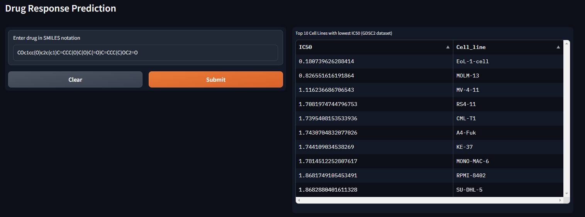

# drug_sensitivity

## Key features of the work

**Dataset Description**: Genomics in Drug Sensitivity in Cancer (GDSC) is a resource for therapeutic biomarker discovery in cancer cells. It contains wet lab IC50 for 100s of drugs in 1000 cancer cell lines. In this dataset, we use **RMD normalized gene expression** for cancer lines and SMILES for drugs. **Y** is the **log normalized IC50**. This is the version 2 of GDSC, which uses improved experimental procedures.

**Task Description**: Regression. Given the gene expression of cell lines and the SMILES of drug, predict the drug sensitivity level.

**Dataset Statistics**: 92,703 pairs, 805 cancer cells and 137 drugs

**Feature Reduction**: We used the gene expression data from [PACCMANN](https://academic.oup.com/nar/article/48/W1/W502/5836770). The gene expression data is reduced to 2,089 represented by the top 20 genes included in the biomolecular interaction network for each drug.

**Fingerprint**: We used the Morgan fingerprint with radius 2 and 1024 bits for the majority of the models, expect for the GCN model and GAT model, which uses graph representation of the drug.

## <ins>Hugging Face Spaces Demo
We implemented a demo of the model using Hugging Face Spaces. The demo can be found [here](https://huggingface.co/spaces/paulo-seixal/drug_sensitivity). The demo allows users to input the drug in SMILES and get the predicted IC50, considering all the cell lines in the GDSC2 dataset.



## Installation of dependencies

### For pip users

```bash

pip install -r requirements.txt

```

### For conda users


 Navigate to the project directory:

   ```bash
    cd drug_sensitivity
   ```


Create a Conda environment:

```bash
conda env create -f environment.yml
```
## Information about the files

**<sis>[data](drug_sensivity/data):**
**<sis>deep_learning:**
**<sis>**
**<sis>**
**<sis>**
**<sis>**
**<sis>**
**<sis>**


## Results

### Baseline Machine Learning Models
After hyperparameter tuning, we report the best performance of each model:

| Model | RMSE | MSE | MAE | R2 |
| --- | --- | --- | --- | --- |
| Linear Regression | 1.19 | 1.41 | 0.88 | 0.81 |
| HistGradientBoosting Regression | 1.14 | 1.30 | 0.86 | 0.83 |
| **XGBoost** | 1.09 | 1.20 | 0.82 | 0.84 |

The best model is XGBoost for IC50 prediction. Used in Hugging Face Spaces Demo - Drug Sensitivity Predictor - previously mentioned.

### Shap Analysis using XGBoost


In SHAP analysis, it is possible to infer that the drugs Fingerprints are the most important features for the prediction of IC50. However, only 3 cell lines (TJP1; SDC4; SLC27A5) appear in the top 20 features that contribute the most to the IC50 prediction. 

### Deep-learning Models

For deep-learning models, we based our implementation on [Delora et al., 2022](https://github.com/BioSystemsUM/drug_response_pipeline). The model is trained for 100 epochs with early stopping patience of 10. The model is trained on a single GPU (NVIDIA GeForce RTX 3050TI).

| Model | RMSE | MSE | MAE | R2 |
| --- | --- | --- | --- | --- |
| **Dense** | 1.10 | 1.21 | 0.82 | 0.84 |
| GAT | 1.19 | 1.43 | 0.90 | 0.81 |
| GCN | 2.42 | 5.87 | 1.82 | 0.23 |

The best model is Dense for IC50 prediction.
